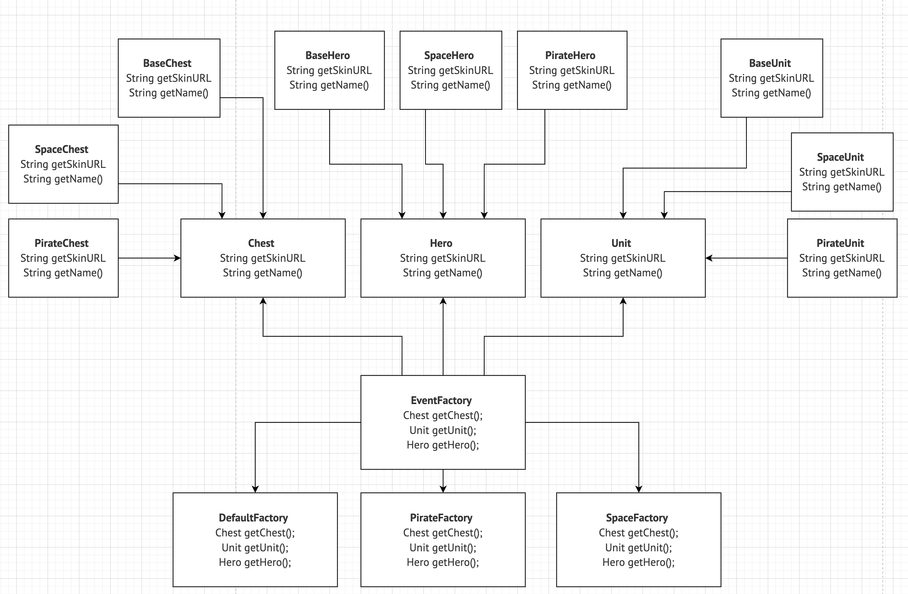

# Шаблоны проектирования

**шаблонный метод почитать**

[https://topjava.ru/blog/pattern-shablonnyy-metod-v-java](https://topjava.ru/blog/pattern-shablonnyy-metod-v-java)

**список**

[https://habr.com/ru/articles/210288/](https://habr.com/ru/articles/210288/)

**бандой четырех (Gang Of Four)**

почитать про паттерн scheduler, monitor, pipeline, railway

чекнуть паттерны спринга (потрошитель видео)

**добавить ссылки на пункты из списка паттернов**

Еще есть несколько “основных” шаблонов проектирования - контейнер, делегирование, канал событий, интерфейс, пулл объектов (этот порождаюший) ([https://www.youtube.com/watch?v=xKB2OqxF_t0&t=44s](https://www.youtube.com/watch?v=xKB2OqxF_t0&t=44s))

**таски на паттерны для практики**

[https://opencoursehub.cs.sfu.ca/bfraser/grav-cms/cmpt373/exercises/design_pattern_exercise](https://opencoursehub.cs.sfu.ca/bfraser/grav-cms/cmpt373/exercises/design_pattern_exercise)

гит чела как у меня примеры чекать можно

[https://github.com/dslsyeoh/design-patterns-exercise/tree/master/src/com/dsl/design/pattern](https://github.com/dslsyeoh/design-patterns-exercise/tree/master/src/com/dsl/design/pattern)

**Builder потом заполнить**

[https://www.geeksforgeeks.org/builder-design-pattern/?ref=ml_lbp](https://www.geeksforgeeks.org/builder-design-pattern/?ref=ml_lbp)

- **Список паттернов**
    
    ## Зачем знать паттерны?
    
    Самое главная причина — паттерны упрощают проектирование и поддержку программ.
    
    **Проверенные решения.**
    
    Ваш код более предсказуем когда вы используете готовые решения, вместо повторного изобретения велосипеда.
    
    **Стандартизация кода.**
    
    Вы делаете меньше ошибок, так как используете типовые унифицированные решения, в которых давно найдены все скрытые проблемы.
    
    **Общий язык.**
    
    Вы произносите название паттерна, вместо того, чтобы час объяснять другим членам команды какой подход вы придумали и какие классы для этого нужны.
    
    ## Каталог шаблонов проектирования
    
    ### Порождающие паттерны:
    
    **Порождающие паттерны** — это паттерны, которые абстрагируют процесс инстанцирования или, иными словами, процесс порождения классов и объектов. Среди них выделяются следующие:
    
    ### [Абстрактная фабрика (Abstract Factory)](https://bool.dev/blog/detail/porozhdayushchie-shablony-abstract-factory)
    
    ### [Строитель (Builder)](https://bool.dev/blog/detail/porozhdayushchie-patterny-pattern-builder)
    
    ### [Фабричный метод (Factory Method)](https://bool.dev/blog/detail/porozhdayushchie-patterny-fabrichnyy-metod)
    
    ### [Прототип (Prototype)](https://bool.dev/blog/detail/porozhdayushchie-patterny-prototype-sharp)
    
    ### [Одиночка (Singleton)](https://bool.dev/blog/detail/pattern-singleton)
    
    ### Структурные паттерны:
    
    **Структурные паттерны** - рассматривает, как классы и объекты образуют более крупные структуры - более сложные по характеру классы и объекты. К таким шаблонам относятся:
    
    ### [Адаптер (Adapter)](https://bool.dev/blog/detail/strukturnye-patterny-adapter-csharp)
    
    ### [Мост (Bridge)](https://jopr.org/blog/detail/strukturnye-patterny-most-csharp)
    
    ### [Компоновщик (Composite)](https://bool.dev/blog/detail/strukturnye-patterny-komponovshchik-csharp)
    
    ### [Декоратор (Decorator)](https://bool.dev/blog/detail/strukturnye-patterny-decorator-csharp)
    
    ### [Фасад (Facade)](https://bool.dev/blog/detail/strukturnye-patterny-facade-csharp)
    
    ### [Приспособленец (Flyweight)](https://bool.dev/blog/detail/strukturnye-shablony-flyweight-csharp)
    
    ### [Заместитель (Proxy)](https://bool.dev/blog/detail/strukturnye-patterny-zamestitel-c)
    
    ### Поведенческие паттерны:
    
    **Поведенческие паттерны** - они определяют алгоритмы и взаимодействие между классами и объектами, то есть их поведение. Среди подобных шаблонов можно выделить следующие:
    
    ### [Цепочка обязанностей (Chain of responsibility)](https://bool.dev/blog/detail/pattern-tsepochka-obyazannostey-chain-of-responsibility)
    
    ### [Команда (Command)](https://bool.dev/blog/detail/pattern-komanda)
    
    ### [Интерпретатор (Interpreter)](https://bool.dev/blog/detail/povedencheskie-patterny-interpretator-csharp)
    
    ### [Итератор (Iterator)](https://bool.dev/blog/detail/pattern-iterator-iterator)
    
    ### [Посредник (Mediator)](https://bool.dev/blog/detail/pattern-posrednik-mediator)
    
    ### [Хранитель (Memento)](https://bool.dev/blog/detail/povedencheskie-patterny-memento-csharp)
    
    ### [Наблюдатель (Observer)](https://bool.dev/blog/detail/pattern-nablyudatel-observer)
    
    ### [Состояние (State)](https://bool.dev/blog/detail/pattern-sostoyanie)
    
    ### [Стратегия (Strategy)](https://bool.dev/blog/detail/pattern-strategiya-strategy)
    
    ### [Шаблонный метод (Template method)](https://bool.dev/blog/detail/pattern--shablonnyy-metod-template-method)
    
    ### [Посетитель (Visitor)](https://bool.dev/blog/detail/pattern-posetitel)
    

## Структрные паттерны

## Adapter

**[https://habr.com/ru/articles/85095/](https://habr.com/ru/articles/577220/)**

> Адаптер — это структурный паттерн, который позволяет подружить несовместимые объекты.                                                                                                                                            Адаптер выступает прослойкой между двумя объектами, превращая вызовы одного в вызовы понятные другому.
> 
- Объектный адаптер пример кода
    
    ```java
    Дан интерфейс IEnemy, который умеет работать только с классом EnemyImpl
    
    public interface IEnemy {
    		void attackWithWeapon();
    }
    
    public class Enemy implements IEnemy {
    		public void attackWithWeapon() {
    			System.out.println("Attack!");
    		}
    }
    
    Но есть очень похожий класс SpecialEnemy, который не умеет атаковать оружием,
    но умеет делать заклинания spell() (аналог attackWithWeapon()) => хочется его
    использовать вместо атаки
    
    public class SpecialEnemy {
    		public void spell() {
    			System.out.println("Spell!");
    		}
    }
    
    Чтобы применять SpecialEnemy как Enemy, введем обертку EnemyAdapter
    добавим конструктор, внутрь которого подается экземпляр SpecialEnemy,
    и наследуемся от интерфейса IEnemy. Таким образом, мы должны имплементировать
    attack() из IEnemy, а внутри имплементации вызвать неудобный метод
    от экземпляра класса SpecialEnemy. Таким обращом, сигнатура метода остается и
    возможно через старый интерфейс применить метод неудобного класса.
    
    public class EnemyAdapter implements IEnemy  {
    		private SpecialEnemy specialEnemy;
    		
    		EnemyAdapter(SpecialEnemy specialEnemy) {
    			this.specialEnemy = specialEnemy;
    		}
    
    		@Override
    		void attack() {
    			specialEnemy.spell();
    		}
    }
    
    public static void main () {
    		SpecialEnemy specialEnemy = SpecialEnemy();
    		EnemyAdapter enemyAdapter = EnemyAdapter(specialEnemy);
    		IEnemy iEnemy_fake = enemyAdapter;
    		Enemy iEnemy_true = Enemy();
    }
    
    Вывод в консоль ниже. То есть нам не нужно вызывать метод spell(), так как
    он переписан в attack(). внутрь адапетра мы кладем реальный объект несовместимого
    класса и сам адаптер наследуем от интерфейса, который мы будем использовать.
    Сам интерфейс даже не будет знать, что внутри него лежит адаптер
    ```
    

[https://habr.com/ru/articles/765468/](https://habr.com/ru/articles/765468/) ←- супер

- Классное объяснение на плюсах с показом разных сигнатур (классовый адаптер)
    
    Паттерн нужен для унифицирования методов к единому интерфейсу, даже если сигнатура (название метода, параметры метода, возвращаемое значение отличаются)
    
    Как сделать?
    
    Реализуется через наследование
    
    Допустим, мы не можем менять классы, но надо их унифицировать и методы под одну оболчку внести
    
    сделать interface CommonAdapter
    
    сделать к каждом классу свой адаптер class FooAdapter, class BarAdapter (implements CommonAdapter)
    
    в каждой имплементации CommonAdapter переопределить единый метод в CommonAdapter, а также в конструкторы поместить свой адаптируемый класс
    
    Успешно применять CommonAdapter для каждого класса
    
    Если класс Foo нужно привести к классу Bar(его интерфейсу), то делается адаптер только для класса Foo (это для объектов???, реализуется через композицию)
    

"Class Adapter" и "Object Adapter" - это два различных подхода к реализации адаптеров в объектно-ориентированных языках программирования, таких как Java. *Они используются для обеспечения совместимости между классами или интерфейсами, которые в противном случае не могли бы работать вместе из-за различий в их интерфейсах или структуре.*

Разница между этими двумя подходами заключается в способе достижения адаптации. В классовом адаптере используется наследование, а в объектном адаптере - композиция. Оба подхода могут быть полезными в разных ситуациях, и выбор зависит от конкретных требований вашей задачи и структуры вашего кода. Классовый адаптер может быть более удобным, если вам нужно адаптировать один класс к интерфейсу. В то время как объектный адаптер может быть более гибким, позволяя адаптировать различные объекты к одному интерфейсу, не меняя их исходные классы.

1. **Class Adapter (классовый адаптер)**:
В случае классового адаптера, используется наследование для адаптации одного интерфейса к другому. Подход этого типа адаптера требует создания нового класса, который наследует от какого-то существующего класса и реализует целевой интерфейс. Это означает, что класс адаптера будет наследовать методы и состояния родительского класса и в то же время реализовывать интерфейс, необходимый для работы с клиентским кодом.

```java
// Интерфейс, который клиентский код ожидает
interface Target {
    void request();
}

// Существующий класс, который нужно адаптировать
class Adaptee {
    void specificRequest() {
        System.out.println("Specific Request");
    }
}

// Класс адаптера, использующий наследование
class ClassAdapter extends Adaptee implements Target {
    @Override
    public void request() {
        specificRequest(); // Вызов метода из Adaptee
    }
}
```

**Object Adapter (объектный адаптер)**:
В случае объектного адаптера, используется композиция (агрегация) объектов для адаптации интерфейса. Этот тип адаптера создает объект, который содержит экземпляр существующего класса и реализует целевой интерфейс. Вся работа делегируется этому внутреннему объекту.

Пример объектного адаптера в Java:

```java
// Интерфейс, который клиентский код ожидает
interface Target {
    void request();
}

// Существующий класс, который нужно адаптировать
class Adaptee {
    void specificRequest() {
        System.out.println("Specific Request");
    }
}

// Класс адаптера, использующий композицию
class ObjectAdapter implements Target {
    private Adaptee adaptee;

    public ObjectAdapter(Adaptee adaptee) {
        this.adaptee = adaptee;
    }

    @Override
    public void request() {
        adaptee.specificRequest(); // Делегирование вызова существующему объекту
    }
}
```

## Bridge

[http://cpp-reference.ru/patterns/structural-patterns/bridge/](http://cpp-reference.ru/patterns/structural-patterns/bridge/)

Шаблон проектирования Bridge используется для *разделения абстракции от её реализации*. Он позволяет изменять и расширять обе стороны независимо друг от друга. 

Этот шаблон обычно применяется, когда существует несколько вариантов реализации функциональности, и каждый вариант может быть скомбинирован с каждой абстракцией. 

Вместо всевозможных комбинаций и миллиона строк кода можно задать свойства как агрегированные поля, а не наследники для каждого случая

В этом паттерне в приоритете используется агрегация, нежели наследование

- что есть абстракция и реализация в контексте?
    
    [https://stackoverflow.com/questions/35079629/does-the-bridge-pattern-decouples-an-abstraction-from-implementation](https://stackoverflow.com/questions/35079629/does-the-bridge-pattern-decouples-an-abstraction-from-implementation)
    
    В паттерне проектирования "Мост" (Bridge), который используется в объектно-ориентированном программировании, абстракция и реализация представляют собой два ключевых компонента для разделения абстракции от её реализации. Этот паттерн позволяет разрабатывать сложные системы, учитывая два независимых измерения, что делает его особенно полезным в случаях, когда изменения в абстракции не должны влиять на реализацию и наоборот.
    
    1. **Абстракция**: Абстракция представляет собой высокоуровневый интерфейс, который определяет логику и функциональность, которую клиентский код должен использовать. Она скрывает детали реализации и предоставляет клиентам удобный способ взаимодействия с объектами. В контексте Java это может быть интерфейсом или абстрактным классом.
    2. **Реализация**: Реализация представляет собой низкоуровневую логику, которая реализует детали функциональности, определенной абстракцией. Она может представлять собой конкретный класс или интерфейс, который реализуется несколькими классами. Реализации могут варьироваться, и путем комбинирования абстракции с разными реализациями можно получить различное поведение.
    
    Паттерн "Мост" позволяет объединить эти два компонента таким образом, чтобы абстракция и реализация могли изменяться независимо друг от друга. Это делает систему более гибкой и способной к расширению, поскольку можно легко добавлять новые абстракции и реализации без изменения существующего кода.
    

- Абстракция - это классы `Shape`, `Circle` и `Square`, представляющие геометрические фигуры.
- Реализация - это интерфейс `Color` и его конкретные реализации `RedColor` и `BlueColor`, представляющие цвета.
- Мост - это связь между абстракцией (геометрическими фигурами) и реализацией (цветами) через встраивание объектов цветов в абстракцию.
- пример кода
    
    ```java
    **Реализация раз - свойство фигуры цвета = интерфейс**
    
    public interface Color {
        void paint();
    }
    
    public class GreenColor implements Color {
        @Override
        public void paint() {
            System.out.print("is green colored");
        }
    }
    
    public class RedColor implements Color {
        @Override
        public void paint() {
            System.out.print("is red colored");
        }
    }
    
    **Реализация два - свойство размера фигуры = интерфейс**
    
    public interface Size {
        void printSize();
    }
    
    public class SmallSize implements Size {
        @Override
        public void printSize() {
            System.out.print("is small sized");
        }
    }
    
    public class MediumSize implements Size {
        @Override
        public void printSize() {
            System.out.print("is medium sized");
        }
    }
    
    **Абстракция фигуры, в своей структуре агрегирует цвет и размер 
    = абстрактный класс, так как нужно иметь поля абстракций**
    
    public abstract class AbstractShape {
        protected Color color; //<--- обязательно указываем protected
        protected Size size;
    
        public AbstractShape(Color color, Size size) {
            this.color = color;
            this.size = size;
        }
        public abstract void draw();
    }
    
    public class SquareShape extends AbstractShape {
    
        public SquareShape(Color color, Size size) {
            super(color, size);
        }
    
        @Override
        public void draw() {
            System.out.print("The square: ");
            color.paint();
            size.printSize();
        }
    }
    
    public class CircleShape extends AbstractShape {
        public CircleShape(Color color, Size size) {
            super(color, size);
        }
    
        @Override
        public void draw() {
            color.paint();
            size.printSize();
        }
    }
    
    public class Main {
        public static void main(String[] args) {
           AbstractShape squareShape = new SquareShape(new RedColor(), new LargeSize());
           AbstractShape triangleShape = new TriangleShape(new YellowColor(), new MediumSize());
           AbstractShape circleShape = new CircleShape(new GreenColor(), new SmallSize());
    
           List<AbstractShape> abstractShapeList = Arrays.asList(squareShape, triangleShape, circleShape);
    
           abstractShapeList.stream().forEach(AbstractShape::draw);
    
        }
    }
    
    Вывод:
    The square: is red colored is large sized
    The triangle: is yellow colored is medium sized
    The circle: is green colored is small sized
    ```
    
    Когда использовать Мост и что это на самом деле?
    
    [https://habr.com/ru/articles/138357/](https://habr.com/ru/articles/138357/)
    
    тезисно:
    
    - Нужно всегда предпочитать агрегацию наследованию везде, где это возможно. Надо найти четкие критерии и свойства, затем положить их внутрь объекта. Если критерия не выделяется, то придется вводить абстрактный класс
    - При применении «Моста» выделяется ВСЯ реализация, т.е. ВСЕ низкоуровневые функции в другой класс, т.е. не функциональность Двигателя из Машины, а низкоуровневая функциональность (private) самой машины в МашинаРеализация
    - Простыми словами - были у нас реализации (по факту Color, Size), мы их наследовали, а нужно комбинировать размеры, цвета и фигуры. Поэтому выделили основную сущность (фигуру) в абстракцию, а реализацию (свойства фигуры - цвет, размер) вынесли полями класса.
    - плюсы паттерна
        - Проще расширять систему новыми типами за счет сокращения общего числа родственных подклассов.
        - Возможность динамического изменения реализации в процессе выполнения программы.
        - Паттерн Bridge полностью скрывает реализацию от клиента. В случае модификации реализации пользовательский код не требует перекомпиляции.
    - схожесть и расхожесть с другими
        
        Паттерны Bridge и Adapter имеют схожую структуру, однако, цели их использования различны. Если [паттерн Adapter](http://cpp-reference.ru/patterns/structural-patterns/adapter/) применяют для адаптации уже существующих классов в систему, то паттерн Bridge используется на стадии ее проектирования.
        
    
    ## **Composite**
    
    > Паттерн Composite - это структурный паттерн проектирования, который позволяет клиентам обращаться к отдельным объектам и их композициям (составным объектам) одинаковым образом.
    > 
    
    **Термины:**
    
    1. **Component**  - это *интерфейс* для всех объектов в композиции, клиентская программа использует базовый компонент для работы с объектами в композиции. Это может быть интерфейс или **[абстрактный класс](https://www.digitalocean.com/community/tutorials/abstract-class-in-java)** с некоторыми методами, общими для всех объектов.
    2. **Leaf** - определяет поведение элементов в композиции. Это строительный блок для композиции и реализует базовый компонент. У него нет ссылок на другие компоненты. Самый примитивный объект в древовидной структуре.
    3. **Composite** - он состоит из конечных элементов и реализует операции в базовом компоненте.
    - Пример кода
        
        ```java
        import java.util.ArrayList;
        import java.util.List;
        
        // Общий интерфейс для всех графических объектов
        interface Graphic {
            void draw();
            double getArea();
        }
        
        // Простая фигура
        class Circle implements Graphic {
            @Override
            public void draw() {
                System.out.println("Отрисовка круга");
            }
        
            @Override
            public double getArea() {
                return Math.PI * 2 * 2; // Площадь круга
            }
        }
        
        // Еще одна простая фигура
        class Square implements Graphic {
            @Override
            public void draw() {
                System.out.println("Отрисовка квадрата");
            }
        
            @Override
            public double getArea() {
                return 4 * 4; // Площадь квадрата
            }
        }
        
        // Композит, представляющий группу графических объектов
        class CompositeGraphic implements Graphic {
            private List<Graphic> graphics = new ArrayList<>();
        
            public void add(Graphic graphic) {
                graphics.add(graphic);
            }
        
            @Override
            public void draw() {
                System.out.println("Отрисовка группы:");
                for (Graphic graphic : graphics) {
                    graphic.draw();
                }
            }
        
            @Override
            public double getArea() {
                double area = 0;
                for (Graphic graphic : graphics) {
                    area += graphic.getArea();
                }
                return area;
            }
        }
        
        public class Main {
            public static void main(String[] args) {
                CompositeGraphic drawing = new CompositeGraphic();
        
                drawing.add(new Circle());
                drawing.add(new Square());
        
                CompositeGraphic group = new CompositeGraphic();
                group.add(new Circle());
                group.add(new Square());
        
                drawing.add(group);
        
                drawing.draw();
                System.out.println("Площадь всего: " + drawing.getArea());
            }
        }
        ```
        
        **Предназначение; плюсы и минусы**
        
        Паттерн Composite полезен в следующих ситуациях:
        
        1. Иерархия объектов: Когда у вас есть иерархия объектов, состоящая из отдельных объектов и их составных групп, и вы хотите обрабатывать их как единое целое. Примеры включают организационную структуру компании, графические элементы (например, дерево форм), или структуру документа (разделы, подразделы, элементы).
        2. Единообразное обращение: Когда вам необходимо предоставить клиентам единообразный интерфейс для работы с отдельными объектами и их составными контейнерами. Это делает код более понятным и удобным для использования, так как клиентам не нужно проверять типы объектов.
        3. Рекурсивная обработка: Паттерн Composite упрощает рекурсивную обработку структурных иерархий. Когда у вас есть древовидная структура, в которой каждый узел может иметь подузлы, вы можете использовать рекурсию для обхода и обработки всей структуры.
        4. Добавление новых типов объектов: Когда вы хотите легко добавлять новые типы объектов в иерархию, не изменяя существующий код. Новые классы могут быть подклассами **`Component`**, что делает расширение иерархии объектов гибким.
        5. Снижение сложности кода: Composite упрощает управление объектами в иерархии, а также обеспечивает уровень абстракции, что позволяет уменьшить сложность кода и сделать его более читаемым.
        6. Составные структуры данных: Composite можно использовать для представления и управления составными структурами данных, такими как деревья, списки и графы.
        
        В целом, паттерн Composite полезен в ситуациях, где необходимо работать с иерархическими структурами объектов и обеспечивать единообразное взаимодействие с разнообразными элементами этой структуры.
        
        **пример хороший** - директория файловой системы состоит из элементов, каждый их которых также может быть директорией. Единый функционал
        
        - **Минусы паттерна**
            1. Сложность удаления элементов: Удаление отдельных элементов из составного объекта может быть сложным. Вы должны быть осторожными, чтобы не нарушить целостность структуры, и это может потребовать дополнительных механизмов или методов для удаления элементов.
            2. Ограничения в типах объектов: В некоторых случаях, если объекты в вашей иерархии имеют разные интерфейсы, то при использовании Composite может потребоваться много приведений типов (type casting) или дополнительных проверок типов. Это может сделать код менее безопасным и менее эффективным.
            3. Избыточность: Иногда применение паттерна Composite может привести к избыточной структуре, особенно если большинство объектов являются листьями (то есть не имеют подузлов). В этом случае, использование Composite может добавить накладные расходы.
            4. Ограничения в операциях: Composite позволяет клиентам обрабатывать объекты как единое целое, но он не предоставляет возможности для выполнения операций, которые зависят от конкретного типа объекта внутри составного объекта. Это может потребовать дополнительной работы для реализации специфических операций.
            5. Управление ресурсами: Если объекты в иерархии управляют ресурсами (например, открытие и закрытие файлов), Composite может затруднить правильное управление этими ресурсами, так как ресурсы могут быть открыты и закрыты на разных уровнях иерархии.
            6. Затраты на память: Использование Composite может увеличить затраты на память, так как каждый объект в составном объекте требует дополнительных ресурсов для хранения информации о своей роли в иерархии.
            
            Необходимо тщательно обдумать, какие задачи требуют применения паттерна Composite, и учесть его минусы и ограничения в соответствии с конкретными требованиями проекта.
            

## Декоратор

[https://habr.com/ru/sandbox/186228/](https://habr.com/ru/sandbox/186228/)

## Абстрактная фабрика

[https://habr.com/ru/articles/575180/](https://habr.com/ru/articles/575180/)

> Абстрактная фабрика - это шаблон проектирования, который позволяет создавать семейства связанных объектов без указания их конкретных классов.
> 

**Использование**

Используйте абстрактную фабрику, когда ваш код должен работать с различными семействами связанных продуктов, но вы не хотите, чтобы он зависел от конкретных классов этих продуктов - они могут быть неизвестны заранее или вы просто хотите обеспечить возможность расширения в будущем.

- **Термины паттерна:** абстрактная фабрика, конкретная фабрика, продукт
    1. **Абстрактная фабрика** (Abstract Factory): Это интерфейс или абстрактный класс, который объявляет методы для создания семейства взаимосвязанных объектов. Эти методы предоставляют абстрактные сигнатуры для создания различных типов объектов без указания их конкретных классов. Абстрактная фабрика определяет, какие типы объектов могут быть созданы.
    2. **Конкретная фабрика** (Concrete Factory): Это класс, который реализует интерфейс абстрактной фабрики. Каждая конкретная фабрика предоставляет конкретные реализации методов для создания объектов из семейства. Например, если абстрактная фабрика определяет методы для создания кнопок и текстовых полей, то конкретная фабрика для графического интерфейса на десктопе будет создавать объекты, соответствующие этим элементам интерфейса.
    3. **Абстрактный** **продукт** (Abstract Product): Это интерфейс или абстрактный класс, который определяет общие методы для объектов, создаваемых фабрикой. Каждый метод определяет функциональность, общую для всех продуктов в семействе, но не содержит конкретной реализации.
    4. **Конкретный** **продукт** (Concrete Product): Это класс, который реализует интерфейс или наследует абстрактный класс абстрактного продукта. Каждая конкретная фабрика создает конкретные продукты, предоставляя конкретную реализацию методов, определенных в абстрактных продуктах. Например, конкретная фабрика для графического интерфейса на десктопе создает конкретные кнопки и текстовые поля.

**Преимущества**

1. **Изолирование деталей создания объектов**: Абстрактная фабрика скрывает детали создания конкретных объектов и семейств объектов от клиентского кода. Это позволяет клиентскому коду работать с абстрактными типами объектов, не зная их конкретных классов. Такое изоляция упрощает поддержку и изменение кода, поскольку клиентский код остается независимым от конкретных реализаций.
2. **Согласованность объектов**: Абстрактная фабрика гарантирует, что созданные объекты будут совместимы между собой. Это особенно полезно, когда объекты должны взаимодействовать друг с другом или быть частью одной системы. Например, если у вас есть графический интерфейс, абстрактная фабрика может обеспечить создание кнопок, текстовых полей и других элементов интерфейса, которые совместимы внешне и функционально.
3. **Уровень абстракции**: Абстрактная фабрика позволяет работать с объектами на более абстрактном уровне, что уменьшает связанность в коде и облегчает его понимание. Клиентский код работает с интерфейсами и абстрактными классами, а не с конкретными реализациями.
4. **Поддержка принципа "Открыто для расширения, закрыто для изменения"**: Абстрактная фабрика способствует созданию расширяемых систем, поскольку добавление новых типов объектов или семейств не требует изменения существующего кода. Вы можете просто добавить новую конкретную фабрику и объекты, не затрагивая клиентский код.
- **Минусы**
    1. **Увеличение сложности кода**: Внедрение абстрактной фабрики может увеличить сложность кода, особенно в небольших проектах, где создание объектов не так критично. Иногда добавление абстрактной фабрики может показаться избыточным и усложнить структуру приложения.
    2. **Перегрузка интерфейса**: Если семейства объектов становятся слишком большими, интерфейс абстрактной фабрики может стать громоздким, и его поддержка может быть сложной. Это может затруднить добавление новых типов объектов или изменение существующих.
    3. **Ограниченность вариантов создания**: Абстрактная фабрика закрепляет набор создаваемых объектов на этапе проектирования. Это может привести к ситуации, когда добавление нового типа объекта или изменение существующего может потребовать значительных изменений в коде, включая изменения в интерфейсе абстрактной фабрики и всех её конкретных реализациях.
    4. **Затруднения при расширении семейств объектов**: При добавлении новых типов объектов в семейство, вы должны также обновить все конкретные фабрики. Это может потребовать большого количества изменений в коде и представлять собой потенциальную опасность, так как существующий код может быть нарушен.
    5. **Не всегда применим**: Абстрактная фабрика наиболее полезна, когда у вас есть несколько семейств объектов, которые должны быть созданы одновременно и использоваться в совместной работе. В других случаях применение этого паттерна может быть излишним.
    6. **Дублирование кода**: В системах с большим количеством конкретных фабрик или объектов может возникнуть дублирование кода, особенно если у разных фабрик есть схожая логика создания объектов.

- **Порядок как заменить дохрена конструкторов на Фабрику**
    1. Составьте матрицу различных типов предметов в сравнении с вариантами этих предметов.
    2. Объявите абстрактные интерфейсы предметов для всех типов событий. Затем заставьте все конкретные классы игровых предметов реализовать эти интерфейсы.
    3. Объявите абстрактный интерфейс фабрики с набором методов создания для всех абстрактных предметов.
    4. Реализуйте набор конкретных фабричных классов, по одному для каждого варианта игрового предмета.
    5. Создайте код инициализации фабрики где-нибудь в приложении. Он должен создать экземпляр одного из конкретных фабричных классов, в зависимости от конфигурации приложения или текущей среды. Передайте этот фабричный объект всем классам, которые создают игровые предметы.
    6. Просмотрите код и найдите все прямые вызовы конструкторов игровых предметов. Замените их вызовами соответствующего метода создания объекта фабрики.

**Пример:**



```java
Архитектура сверху, а здесь:

1) класс Игры использующий все это
//entity for game in Main.java, it is important class
public class GameApplication {
    private ChestAbstractProduct chestAbstractProduct;
    private HeroAbstractProduct heroAbstractProduct;

    public GameApplication(GameEventAbstractFactory gameEventAbstractFactory) {
        this.chestAbstractProduct = gameEventAbstractFactory.getChest();
        this.heroAbstractProduct = gameEventAbstractFactory.getHero();
    }

    public void printParameters() {
        System.out.print("Hero parameters: ");
        heroAbstractProduct.getAbiliity();
        heroAbstractProduct.getLevel();

        System.out.print(String.format("Chest parameters: %s, %s",
                chestAbstractProduct.getName(), chestAbstractProduct.getUrl()));
    }

    public ChestAbstractProduct getChestAbstractProduct() {
        return chestAbstractProduct;
    }

2) main
public class Main {

    public static void main(String[] args) {
        GameApplication application = new GameApplication(new SpaceConcreteFactory());
        application.printParameters();

        application = new GameApplication(new BaseConcreteFactory());
        application.printParameters();
```

То есть задаем интерфейс фабрик, далее реализуем фабрики по семействам: Space, Base, это локации игры

Потом задаем интерфейс составляющих игры, которые будут в каждой локации

Потом в приложении игры GameApplication задаем конструктор, которые имеет поля hero, chest, параметр конструктора один - абстрактная фабрика, и тот продукт, который выкинет фабрика надо в поля положить GameApplication

Таким образом в мэйне можно задать параметры только под локацию, а конкретные реализации продуктов пишу сам с хардкодными значениями

Вывод в консоль


## Фабричный метод

[https://habr.com/ru/articles/571502/](https://habr.com/ru/articles/571502/)

> **Фабричный метод** - это порождающий шаблон проектирования, который предоставляет интерфейс для создания объектов в родительском классе,  но позволяет подклассам изменять тип создаваемых объектов.
> 
- Чем он похож на абстрактную фабрику - кратко: более частный случай фабрики, работа не с семействами объектов, а с конкретными одиночными объектами
    
    Абстрактная фабрика (Abstract Factory) и фабричный метод (Factory Method) - это два паттерна проектирования, которые используются для создания объектов, но они решают разные задачи и имеют разные структуры.
    
    1. Фабричный метод (Factory Method):
        - Фабричный метод - это паттерн проектирования, который определяет интерфейс для создания объекта, но оставляет решение о конкретном классе объекта производителю (классу, который наследует интерфейс фабрики).
        - Классы, реализующие фабричный метод, могут изменяться, чтобы создавать разные подклассы объектов.
        - Этот паттерн полезен, когда у вас есть семейство связанных объектов, и вы хотите, чтобы клиентский код был независим от конкретных классов объектов.
    2. Абстрактная фабрика (Abstract Factory):
        - Абстрактная фабрика - это паттерн проектирования, который предоставляет интерфейс для создания семейств взаимосвязанных или взаимозависимых объектов без указания их конкретных классов.
        - Этот паттерн используется, когда у вас есть несколько семейств объектов, и клиентский код должен работать с одним из этих семейств.
        - Абстрактная фабрика создает набор фабричных методов (каждый для своего семейства объектов), и клиентский код выбирает семейство, с которым он хочет работать, и использует соответствующую фабрику.
    
    Основное различие между ними заключается в том, что фабричный метод решает проблему создания конкретных объектов, в то время как абстрактная фабрика решает проблему создания семейств связанных объектов.
    
- Его **плюсы** когда применили паттерн
    
    [https://softwareengineering.stackexchange.com/questions/200647/why-is-the-factory-method-design-pattern-more-useful-than-having-classes-and-cal](https://softwareengineering.stackexchange.com/questions/200647/why-is-the-factory-method-design-pattern-more-useful-than-having-classes-and-cal)
    
    The key advantages of the Factory pattern are twofold:
    
    1. The places that need an implementation of the product do not need to know how to construct one. **The factory holds that information.**
        
        Do you want to know what arguments to pass to the particular constructor? Or what dependencies you have to inject? Or how to register the implementation class with the database after it is fully configured? No? Let the factory look after all that stuff.
        
    2. The places that need an implementation of the product do not need to know at the time of module description (i.e., at compilation time) what the name of the implementation class is.
        
        Thus, `a` need not have anything to do with `A`; the “what to build” can be described in terms of the desired non-functional properties, and not just the name. This is much more flexible.
        
    
    The downside is that where you know what to make and how to do it, you get more complexity when you use a factory. The fix to that is simple though: don't use a factory when it doesn't make sense!
    
- Применение на живом примере
    
    Код, использующий фабричный метод (часто называемый клиентским кодом), не видит разницы между фактическими продуктами, возвращаемыми различными подклассами. Клиент рассматривает все продукты как абстрактную награду. Клиент знает, что все награды должны иметь метод применения награды, но то, как именно он работает, не имеет значения для клиента.
    
    Шаблон фабричного метода предлагает заменить прямые вызовы построения объекта (с использованием оператора new) на вызовы специального фабричного метода. Не волнуйтесь: объекты по-прежнему создаются с помощью оператора new, но он вызывается из фабричного метода. Объекты, возвращаемые фабричным методом, часто называют продуктами.
    
    На первый взгляд это изменение может показаться бессмысленным: мы просто переместили вызов конструктора из одной части программы в другую. Однако учтите следующее: теперь вы можете переопределить фабричный метод в подклассе и изменить класс продуктов, создаваемых этим методом.
    
    Однако есть небольшое ограничение: подклассы могут возвращать разные типы продуктов, только если эти продукты имеют общий базовый класс или интерфейс. Кроме того, тип возвращаемого значения для фабричного метода в базовом классе должен быть объявлен как этот интерфейс.
    
    Например, классы **GoldReward** и **GemReward** должны реализовывать интерфейс наград, в котором объявляется метод **rewardFor**. Каждый класс реализует этот метод по-разному: золотая награда увеличивает золото, награда с гемами увеличивает гемы в профиле игрока. Фабричный метод в классе **GoldRewardService** возвращает объекты золотой награды, тогда как фабричный метод в классе GemRewardService возвращает гемы.
    
    Код, использующий фабричный метод (часто называемый клиентским кодом), не видит разницы между фактическими продуктами, возвращаемыми различными подклассами. Клиент рассматривает все продукты как абстрактную награду. Клиент знает, что все награды должны иметь метод применения награды, но то, как именно он работает, не имеет значения для клиента.
    
- Структура и как реализовывать
    
    **Structure**
    
    1. Интерфейс **GameItem**, который является общим для всех объектов наград, которые могут быть созданы создателем и его подклассами.
    
    - Конкретные награды - это разные реализации интерфейса **GameItem**.
    - Класс **ReawardCreator** объявляет фабричный метод, который возвращает новые объекты наград. Важно, чтобы тип возвращаемого значения этого метода соответствовал интерфейсу продукта. Вы можете объявить фабричный метод абстрактным, чтобы заставить все подклассы реализовывать свои собственные версии метода. В качестве альтернативы базовый фабричный метод может возвращать некоторый тип награды по умолчанию. Обратите внимание: несмотря на название, создание продукта не является основной обязанностью создателя. Обычно класс создателя уже имеет некоторую базовую бизнес-логику, связанную с наградами. Фабричный метод помогает отделить эту логику от конкретных классов наград.
    - Конкретные создатели переопределяют базовый фабричный метод, поэтому он возвращает другой тип продукта. Обратите внимание, что фабричный метод не должен постоянно создавать новые экземпляры. Он также может возвращать существующие объекты из кеша, пула объектов или другого источника.
- Указание на применимость
    
    Используйте фабричный метод, если вы хотите предоставить пользователям вашей библиотеки или фреймворка способ расширения его внутренних компонентов.
    
    Наследование - это, вероятно, самый простой способ расширить поведение библиотеки или фреймворка по умолчанию. Но как фреймворк распознает, что ваш подкласс следует использовать вместо стандартного компонента?
    
    Решение состоит в том, чтобы сократить код, который создает компоненты в рамках платформы, до единого фабричного метода и позволить любому переопределить этот метод в дополнение к расширению самого компонента.
    
- Реализация **моими словами**
    
    Есть дохрена похожих классов продуктов, которые имеют одинаковый функционал, ну или расширяем продукты, мы не хотим каждый раз писать че за реализация внутри продукта и вызывать конструкторы, мы все конструкторы заменим на генераторы этих продуктов
    
    1. Введем интерфейс для продуктов IProduct, реализуем все продукты
    2. Введем абстрактный класс/интерфейс IGenerator генератор продуктов, в нем абстрактные методы создания продуктов возвращают интерфейс IProduct
    3. Реализуем генераторы продуктов, по факту перенеся вызов new Product() в эти генераторы
    4. Вуаля! Вместо того чтобы писать писать new ConcreteProduct, мы будем использовать интерфейс IGenerator generator = new ConcreteGenerator() и вызовем generator.create() → IProduct, который является оболочкой для ConcreteProduct. То есть от конкретных объектов мы полностью перешли на абстрактность
- чем отличается по дизайну Фабричный метод и Мост?
    
    [https://stackoverflow.com/questions/57307658/what-is-the-difference-between-factory-method-design-pattern-and-bridge-pattern](https://stackoverflow.com/questions/57307658/what-is-the-difference-between-factory-method-design-pattern-and-bridge-pattern)
    

Код статьи хабр, который я переписал, будет храниться в Гите по ссылке в начале

## Декоратор

хороший пример на skillbox

[https://skillbox.ru/media/base/shablon-dekorator-supersila-klassovobyertok/](https://skillbox.ru/media/base/shablon-dekorator-supersila-klassovobyertok/)

пример на шарпе, но тоже годно описано

[https://bool.dev/blog/detail/strukturnye-patterny-decorator-csharp](https://bool.dev/blog/detail/strukturnye-patterny-decorator-csharp)

> Декоратор - это структурный паттерн проектирования, который позволяет динамически добавлять новое поведение или функциональность объекту, не изменяя его код.                                                                                                                                     *Используется для расширения функциональности объектов. Являясь гибкой альтернативой порождению классов, паттерн Decorator динамически добавляет объекту новые обязанности.*
> 
- Термины паттерна - декоратор, конкретный декоратор и тд
    - **Component**: абстрактный класс, который определяет интерфейс для наследуемых объектов.
    - **ConcreteComponent**: конкретная реализация компонента, в которую с помощью декоратора добавляется новая функциональность.
    - **Decorator**: собственно декоратор (класс обертка над компонент), реализуется в виде абстрактного класса и имеет тот же базовый класс, что и декорируемые объекты. Поэтому базовый класс Component должен быть по возможности легким и определять только базовый интерфейс.
        
        Класс декоратора также хранит ссылку на декорируемый объект в виде объекта базового класса Component и реализует связь с базовым классом как через наследование, так и через отношение агрегации.
        
    - **Классы** ConcreteDecoratorA и ConcreteDecoratorB представляют дополнительные функциональности, которыми должен быть расширен объект ConcreteComponent.


- минусы декоратор
    1. **Чувствительность к порядку.** Код инициализации декораторов очень важен, поскольку именно в процессе создания определяются вложенность и порядок исполнения разных декораторов.
    2. **Сложность отладки.** Разработчику, незнакомому с этим паттерном, замер времени исполнения или кэширование результатов декораторами может показаться черной магией. Отлаживать проблемы, которые возникли внутри декоратора, может быть довольно сложно.
    3. **Увеличение сложности.** Декоратор является довольно тяжеловесным паттерном, к которому стоит прибегать тогда, когда выделяемый аспект поведения достаточно сложен. Если нужно кэшировать результаты в одном из десяти методов, то сложность, привнесенная декоратором, будет неоправданна.
- почему и когда использовать формальными словами
    1. Добавление функциональности без изменения базового класса: Если вам нужно добавить или изменить функциональность объекта, но вы не хотите менять исходный код базового класса, декоратор позволяет динамически добавлять новые возможности без изменения существующего кода.
    2. Комбинирование функциональности: Декораторы позволяют комбинировать несколько функциональных возможностей и изменять порядок их применения, обеспечивая высокую гибкость.
    3. Избегание "надувания" класса: Когда класс имеет слишком много методов и каждый метод реализует один аспект функциональности, это может привести к "надуванию" класса. Вместо создания огромных классов с разнообразной функциональностью, декоратор позволяет разделить эту функциональность на отдельные классы.
    4. Работа с разными вариантами конфигурации: Декораторы могут быть полезными, когда у вас есть несколько вариантов конфигурации объекта, и вы хотите выбирать и комбинировать их динамически.
    5. Отделение обязанностей: Декоратор помогает поддерживать принцип единственной ответственности (Single Responsibility Principle), так как каждый декоратор отвечает только за свой аспект функциональности.
- где использовать на примерах
    
    Декоратор позволяет динамически расширять поведение объектов. Он идеально подходит для расширения поведения всех методов интерфейса, которое не является частью основной функциональности. Если кэшировать нужно лишь результаты одного метода класса, то использование декоратора будет слишком тяжеловесным.
    
    1. Декораторы применяются для добавления всем методам интерфейса некоторого поведения, которое не является частью основной функциональности. Декораторы отлично подходят для решения следующих задач:
    2. кэширования результатов работы;
    3. камера времени исполнения методов;
    4. логирования аргументов;
    5. управления доступом пользователей;
    
    модификации аргументов или результата работы методов упаковки/распаковки, шифрования и т. п.
    
- альтернативные паттерны в похожих кейсах
    
    
    | https://en.wikipedia.org/wiki/Adapter_pattern | Converts one interface to another so that it matches what the client is expecting |
    | --- | --- |
    | Decorator | Dynamically adds responsibility to the interface by wrapping the original code |
    | https://en.wikipedia.org/wiki/Facade_pattern | Provides a simplified interface |
- как реализовать своими словами
    
    Создаем абстрактный класс декоратор, который наследует интерфейс IComponent (ограничение на методы, контракт, поэтому надо базовый component сделать максимально легким); далее пишем абстрактный класс AbstractDecorator  1) в нем конструктор принимает класс Component, 2) в нем есть агрегированное поле IComponent 3) методы интерфейса остаются абстрактными. Далее пишем конкретный декоратор, он имплементит AbstractDecorator, в нем вызываются методы IComponent, но там своя логика, добавляется какая-нибудь наворочка
    

## Фасад

[http://cpp-reference.ru/patterns/structural-patterns/facade/](http://cpp-reference.ru/patterns/structural-patterns/facade/)

> Паттерн Facade предоставляет унифицированный интерфейс вместо набора интерфейсов некоторой подсистемы. Facade определяет интерфейс более высокого уровня, упрощающий использование подсистем, оборачивая сложную подсистему в упрощенный интерфейс
> 
- Более подробное описание как работает клиент
    
    Паттерн Facade инкапсулирует сложную подсистему в единственный интерфейсный объект. Это позволяет сократить время изучения подсистемы, а также способствует уменьшению степени связанности между подсистемой и потенциально большим количеством клиентов. С другой стороны, если фасад является единственной точкой доступа к подсистеме, то он будет ограничивать возможности, которые могут понадобиться "продвинутым" пользователям.
    
    Объект Facade, реализующий функции посредника, должен оставаться довольно простым и не быть всезнающим "оракулом".
    
    Клиенты общаются с подсистемой через Facade. При получении запроса от клиента объект Facade переадресует его нужному компоненту подсистемы. Для клиентов компоненты подсистемы остаются "тайной, покрытой мраком". То есть для клиента не видные внутренние процессы под фасадным методом - клиент только дергает одну ниточку, дальше происходит все внутри само.
    
- Предназначение и в чем польза
    1. **Фасад** предоставляет быстрый доступ к определённой функциональности подсистемы. Он «знает», каким классам нужно переадресовать запрос, и какие данные для этого нужны.
    2. **Дополнительный фасад** можно ввести, чтобы не «захламлять» единственный фасад разнородной функциональностью. Он может использоваться как клиентом, так и другими фасадами.
    3. **Сложная подсистема** состоит из множества разнообразных классов. Для того, чтобы заставить их что-то делать, нужно знать подробности устройства подсистемы, порядок инициализации объектов и так далее.Классы подсистемы не знают о существовании фасада и работают друг с другом напрямую.
    4. **Клиент** использует фасад вместо прямой работы с объектами сложной подсистемы.
- Как проектируется фасад по шагам
    - Определите для подсистемы простой, унифицированный интерфейс.
    - Спроектируйте класс "обертку", инкапсулирующий подсистему.
    - Вся сложность подсистемы и взаимодействие ее компонентов скрыты от клиентов. "Фасад" / "обертка" переадресует пользовательские запросы подходящим методам подсистемы.
    - Клиент использует только "фасад".
    - Рассмотрите вопрос о целесообразности создания дополнительных "фасадов".
- Сходства и отличия от других паттернов (Адаптер, Flyweight, Mediator, AbstractFactory, Singleton)
    - Facade определяет новый интерфейс, в то время как [Adapter](http://cpp-reference.ru/patterns/structural-patterns/adapter/) использует уже имеющийся. Помните, Adapter делает работающими вместе два существующих интерфейса, не создавая новых.
    - Если [Flyweight](http://cpp-reference.ru/patterns/structural-patterns/flyweight/) показывает, как сделать множество небольших объектов, то Facade показывает, как сделать один объект, представляющий целую подсистему.
    - [Mediator](http://cpp-reference.ru/patterns/behavioral-patterns/mediator/) похож на Facade тем, что абстрагирует функциональность существующих классов. Однако Mediator централизует функциональность между объектами-коллегами, не присущую ни одному из них. Коллеги обмениваются информацией друг с другом через Mediator. С другой стороны, Facade определяет простой интерфейс к подсистеме, не добавляет новой функциональности и не известен классам подсистемы.
    - [Abstract Factory](http://cpp-reference.ru/patterns/creational-patterns/abstract-factory/) может применяться как альтернатива Facade для сокрытия платформенно-зависимых классов.
    - Объекты "фасадов" часто являются [Singleton](http://cpp-reference.ru/patterns/creational-patterns/singleton/), потому что требуется только один объект Facade.
    - Adapter и Facade в являются "обертками", однако эти "обертки" разных типов. Цель Facade – создание более простого интерфейса, цель Adapter – адаптация существующего интерфейса. Facade обычно "обертывает" несколько объектов, Adapter "обертывает" один объект.
- Яркие черты
    - Не добавляет новой функциональности, только упрощение взаимодействия клиента с системой
    - Идет добавление нового интерфейса и композирует более простые составляющие
    - Фасад ослабляет связь между компонентами системы: компоненты с взаимодействием с клиентским кодом можно не менять, менять нужно лишь фасад при добавлении нового метода или изменении, на высоком уровне все остается неизменным, можно не перекомпилировать файлы
    - Паттерн не претендует на сокрытие своих членов, к ним можно получить прямой доступ вне фасада
    - По факту, как и Адаптер, является оберткой
    - Фасад обычно является синглтоном
    

**Пример**

Вместо непосредственной работы с дюжиной классов, фасад предоставляет коду приложения единственный метод для конвертации видео, который сам заботится о том, чтобы правильно сконфигурировать нужные объекты фреймворка и получить требуемый результат.


## Flyweight (Приспособленец)

- источники
    
    классик полноценная статья на плюсах
    
    [http://cpp-reference.ru/patterns/structural-patterns/flyweight/](http://cpp-reference.ru/patterns/structural-patterns/flyweight/)
    
    более живой пример и разжевываная информация
    
    [https://www.youtube.com/watch?v=AEmYXzSOIDk](https://www.youtube.com/watch?v=AEmYXzSOIDk)
    

супер видео с понятным объяснением

[https://www.youtube.com/watch?v=SsCtAmlatsI](https://www.youtube.com/watch?v=SsCtAmlatsI)

> Паттерн Flyweight использует разделение для эффективной поддержки большого числа мелких объектов.
> 


- Зачем использовать: плюсы
    - Главное - уменьшает затраты памяти на создание примтивных объектов за счет одновременного использования двух паттерн - синглтон и фабричный метод. Для экономии памяти вводится класс Фабрики, который держит в кеше уже созданные примитивные классы и вызывает их, создавая новые при отсутствии. Одним словом, оптимизация нагрузки на память.
    
- Как определить что выносить во внешний контекст, а что во внутренний (разделяемые данные)
- Общая структура, как его реализовать - алгоритм
    - Убедитесь, что существует проблема повышенных накладных расходов.
    - Разделите состояние целевого класса на разделяемое (внутреннее) и неразделяемое (внешнее).
    - Удалите из атрибутов (членов данных) класса неразделяемое состояние и добавьте его в список аргументов, передаваемых методам.
    - Создайте фабрику, которая может кэшировать и повторно использовать существующие экземпляры класса.
    - Для создания новых объектов клиент использует эту фабрику вместо оператора new.
    - Клиент (или третья сторона) должен находить или вычислять (в идеале) неразделяемое состояние и передавать его методам класса.
- Живой пример из видео
    
    > Описание задачи:                                                                                                                      Дан текстовый редактор. Мы можем писать текст, используя символы, нужно это делать в определенных местах экрана, то есть нужны координаты. Но если каждый раз через new создавать объект символа, то будет много экземпляров, большая нагрузка на память. А ведь символы имеют общие параметры, например стиль текста symbolStyle, и сама эмблема символа symbolPicture. Мы можем использовать паттерн Приспособленец, инициализировав все символы в виде объектов, которые будут храниться внутри мапы
    > 
    
    Сама реализация по шагам по тому алгоритму сверху
    
    1. Много символов похожих плюс минус - высокая нагрузка по памяти
    2. Разделим внутреннее состояние - поля symbolStyle, symbolPicture (ну или для хорошего примера уже константные поля кроме ключа name) и внешнее, которое и является внешним контекстом, который будет передаваться клиентским кодом в метод  приспособленцев при их вызове. Во внешнем контексте будут лежать координаты рисования
    3. Далее введем класс SymbolFactory, который будет вытягивать синглтон экземпляры нужных нам символов, которые будут храниться в мапе
    4. Объекты приспособленцев будут закрепленными, то есть все будет в **модификаторах** **final**, мы их задаем в самом начале через конструктор - передаем стиль и картинку символа и будем использовать неизменяемый объект до конца программы. Хочется ввести тот же символ(его название - ключ в мапе), но с другим стилем или картинкой? Создай еще один объект с другим ключом и положи его в мапу, ну или вынеси стиль и картинку во внешний контекст, тогда вычисления будут производиться прямо в клиентском коде.

## Прокси

> Прокси - структурный шаблон проектирования, предоставляющий объект, который контролирует доступ к другому объекту, перехватывая все вызовы                                   То есть,  вводится еще один слой абстракции между компонентом (или сервером) и клиентом. Прокси класс оборачивает целевой класс и имитирует его  функциональность, при этом содержит дополнительную логику и в то же время контролирует класс в оболочке
> 


- источники
    
    классное объяснение с использованием реальных примеров
    
    [https://www.geeksforgeeks.org/proxy-design-pattern/](https://www.geeksforgeeks.org/proxy-design-pattern/)
    
    классика, но хуже чем обычно
    
    [http://cpp-reference.ru/patterns/structural-patterns/proxy/](http://cpp-reference.ru/patterns/structural-patterns/proxy/)
    
- Характерные черты Прокси - объекта
    
    (далее буду называть оборачиваемый класс компонентом)
    
    - Имплементирует тот же интерфейс, что и компонент ⇒ клиент не догадывается, использует ли он реальный объект или его прокси-оболочку. В то же время прокси считает, что взаимодействует с реальным сервером(может быть и с другим прокси на самом деле)
    - Содержит ссылку на компонент
    - Перехватывает вызовы реального объекта и добавляет доп. логику (например, защита)
    - Не изменяет переменные на вход и возврат, будто пропуская сквозь себя, чтобы те дошли до реального объекта
- Виды прокси - виртуальный, защитный, удаленный, умный (счетчик, кэширующий)
    1. **Виртуальный прокси (Virtual Proxy):**
        
        Виртуальный прокси позволяет отложить создание или загрузку дорогостоящего ресурса, такого как большое изображение или сложный объект, до тех пор, пока это действительно не потребуется. Вместо того, чтобы загружать ресурс сразу при создании объекта, виртуальный прокси создает заглушку (пустой объект), а реальный объект загружается только тогда, когда клиент первый раз обращается к нему. Это улучшает производительность и экономит ресурсы. 
        
    2. **Удаленный прокси (Remote Proxy):**
        
        Удаленный прокси используется для предоставления локальному клиенту доступа к объектам, находящимся в удаленной системе. Он обеспечивает интерфейс, аналогичный интерфейсу объекта, находящегося в удаленной системе, и пересылает запросы между клиентом и удаленным объектом.                                        Это позволяет клиенту взаимодействовать с удаленным объектом, не зная его фактического местонахождения. То есть локальный объект есть, который проксирует объект из другого адресного пространства, “заглушка”.
        
    3. **Защитный прокси (Protective Proxy):**
        
        Защитный прокси контролирует доступ к реальному объекту, обеспечивая дополнительный уровень безопасности. Он может выполнять различные проверки доступа, аутентификацию и авторизацию перед тем, как передать запрос на реальный объект.                                                                                                                            1) Например, защитный прокси может ограничивать доступ к определенным методам объекта или проверять права доступа клиента.                                                                          
        
        2) Или из жизни:  отправляется очередь смсок клиентам супермаркета, что ему зачислили бонусные баллы на карту. Но пока очередь дошла, он уже успел их потратить, тогда смс уже неактуальна и прокси объект может проверить этот факт, блокируя отправку смс в последнем сценарии.
        
    4. **Кэширующий прокси (Caching Proxy):**
        
        Кэширующий прокси используется для хранения результатов выполнения операций, чтобы избежать повторных вычислений. Он сохраняет копии результатов операций и предоставляет их клиентам, если более ранние запросы повторяются. Это увеличивает производительность и снижает нагрузку на ресурсы.                 Пример - кэши hibernate (сохраняет сущности вытянутые из базы)
        
    5. **Счетчиковый прокси (Counting Proxy):**
        
        Счетчиковый прокси используется для отслеживания количества обращений к реальному объекту. Это полезно для мониторинга использования объектов и сбора статистики.                                                                                                                                    1) Например, счетчиковый прокси может использоваться для подсчета количества запросов к определенному методу объекта. Счётчик запросов смсок пользователю. 2) Подсчет числа ссылок на реальный объект. При отсутствии ссылок память под объект автоматически освобождается (известен также как интеллектуальный указатель или smart pointer).
        
    6. **Доступ к объекту (Access Proxy):**
        
        Этот тип прокси-шаблона предоставляет более удобный или уровневый интерфейс к объекту. Он может добавлять дополнительную функциональность или абстрагировать сложный объект, чтобы сделать его более удобным в использовании. 
        
- Дельное замечание об особенностях прокси
    
        Мне кажется, очень мало раскрыто по использованию данного шаблона. А ведь это один из самых популярных в **EJB-технологии**. По сути все EJB сделаны в той или иной 
    
        1) Proxy также (и, наверно, в основном) используются для оборачивания основного объекта некоторой оболочкой, контролирующей его работу. Например, оборачиванием каждого вызова в проверку и открытие транзакции, включение профайлинга и т.д., проверку наличия security credentials и прав доступа на объект. При этом метод исходного объекта, обычно, вызывается «без купюр» — то есть не происходит модификации аргументов вызова или результатов (кроме уже их оборачивания в прокси).Кстати, использование proxy == null / getProxy() является примером т.н. ***LazyProxy***, являющимся ещё одним шаблоном проектирования. Самый известный (с моей точки зрения) пример использования — ***Lazy-инициализация*** бинов в Hibernate.
    
        2) Создание Proxy в простейшем случае делается с помощью классов Proxy / ***InvokationHandler***, которые позволяют создать прокси для любого набора *интерфейсов*. Однако часто приходится ***оборачивать не интерфейсы, а классы.*** В этом случае используются фреймворки (вроде CGLIB / ASM / Javaassist) для ***реализации шаблона Proxy через наследование***, т.е. через создание дочернего класса и ***оборачивания всех super-вызовов нужным кодом***. Это всё, конечно, в случае необходимости оборачивания Proxy в ***runtime***, когда класс на момент компиляции не знает, что придётся оборачивать. И хотя при этом страдает производительность, данный подход имеет плюсы и в случае статической компиляции — если мы добавим новый метод в исходный объект, в «динамических» прокси нам менять ничего не нужно, а вот «статические» придётся дописывать.
    
    3) Proxy бывают и нелокальные, например, предназначенные для вызова методов объекта в удалённой JVM. Обычно реализуются через Proxy / InvokationHandler, так как у объекта есть RemoteInterface.
    
- AOP, InvocationHandler, JavaProxy
    
    **`InvocationHandler`** - это интерфейс в языке Java, который используется в контексте рефлексии и динамического проксирования. Он является частью Java API, связанного с Java Proxy классом и позволяет создавать динамические прокси-объекты для интерфейсов.
    
    **`InvocationHandler`** содержит один метод:
    
    ```java
    javaCopy code
    Object invoke(Object proxy, Method method, Object[] args) throws Throwable;
    ```
    
    Этот метод вызывается каждый раз, когда вызывается метод на динамическом прокси-объекте, созданном с использованием **`Proxy.newProxyInstance()`**. Метод **`invoke`** получает следующие параметры:
    
    1. **`proxy`**: Это сам динамический прокси-объект, на котором был вызван метод. Внутри метода **`invoke`** вы можете использовать **`proxy`** для перенаправления вызова на реальный объект (если это необходимо) или для выполнения других действий.
    2. **`method`**: Это объект класса **`Method`**, представляющий вызванный метод. Вы можете использовать этот объект для определения имени и другой информации о вызываемом методе.
    3. **`args`**: Это массив аргументов, переданных вызываемому методу.
    
    Метод **`invoke`** должен вернуть результат выполнения вызванного метода. Это позволяет вам выполнять дополнительную логику, например, валидацию, логирование или перенаправление вызовов на реальные объекты.
    
    **`InvocationHandler`** часто используется в сочетании с **`Proxy.newProxyInstance()`**, чтобы создавать динамические прокси-объекты для интерфейсов. Это может быть полезно, например, при создании систем аспектно-ориентированного программирования (AOP) или при реализации паттернов, таких как удаленный прокси или кэширующий прокси.
    
- Реальное применение
    - прокси в АОП Spring - аспектное программирование
        
        [https://habr.com/ru/articles/597797/](https://habr.com/ru/articles/597797/)
        
    - EJB-технология - Jacarta
    - **Рефлексия (почитать позже)**
    

## Цепочка обязанностей (Chain of reponsibility)

> **Цепочка Обязанностей (Chain of responsibility)** - поведенческий шаблон проектирования, который позволяет избежать жесткой привязки отправителя запроса к получателю. Все возможные обработчики запроса образуют цепочку, а сам запрос перемещается по этой цепочке. Каждый объект в этой цепочке при получении запроса выбирает, либо закончить обработку запроса, либо передать запрос на обработку следующему по цепочке объекту.
> 


- источники
    
    годный и простой пример
    
    [https://www.digitalocean.com/community/tutorials/chain-of-responsibility-design-pattern-in-java](https://www.digitalocean.com/community/tutorials/chain-of-responsibility-design-pattern-in-java)
    
    [http://cpp-reference.ru/patterns/behavioral-patterns/chain-of-responsibility/](http://cpp-reference.ru/patterns/behavioral-patterns/chain-of-responsibility/)
    
- более развернутая функция паттерна
    
    Паттерн Chain of Responsibility связывает в цепочку объекты-получатели, а затем передает запрос-сообщение от одного объекта к другому до тех пор, пока не достигнет объекта, способного его обработать. Число и типы объектов-обработчиков заранее неизвестны, они могут настраиваться динамически. Механизм связывания в цепочку использует рекурсивную композицию, что позволяет использовать неограниченное число обработчиков.
    
    Паттерн Chain of Responsibility упрощает взаимосвязи между объектами. Вместо хранения ссылок на всех кандидатов-получателей запроса, каждый отправитель хранит единственную ссылку на начало цепочки, а каждый получатель имеет единственную ссылку на своего преемника - последующий элемент в цепочке.
    
    Убедитесь, что система корректно "отлавливает" случаи необработанных запросов.
    
    Не используйте паттерн Chain of Responsibility, когда каждый запрос обрабатывается только одним обработчиком, или когда клиент знает, какой именно объект должен обработать его запрос.
    
- когда его стоит использовать, а когда нет?
    
    Использовать когда:
    
    - Когда имеется более одного объекта, который может обработать определенный запрос
    - Когда надо передать запрос на выполнение одному из нескольких объект, точно не определяя, какому именно объекту
    - Когда набор объектов задается динамически
    
    Не использовать когда:
    
    - Не используйте паттерн Chain of Responsibility, когда каждый запрос обрабатывается только одним обработчиком, или когда клиент знает, какой именно объект должен обработать его запрос.
- реальные примеры
    - try-catch блоки ъ
        
        Давайте посмотрим пример шаблона цепочки ответственности в JDK, а затем перейдем к реализации реального примера этого шаблона. Мы знаем, что у нас может быть несколько блоков catch в коде блока [try-catch-catch](https://www.digitalocean.com/community/tutorials/java-try-with-resources). Здесь каждый блок catch является своего рода процессором для обработки этого конкретного исключения. Поэтому, когда в блоке try возникает какое-либо исключение, его отправляют в первый блок catch для обработки. Если блок catch не в состоянии обработать его, он пересылает запрос следующему объекту в цепочке, т.е. следующему блоку catch. Если даже последний блок catch не в состоянии его обработать, исключение выбрасывается вызывающей программе за пределы цепочки.
        
    - 
- реализация паттерна моими словами
    
    далее термины:  Interface/abstract class Handler;  ClassImpl ConcreteHandler
    
    - Каждый обработчик реализует интерфейс родитель, где есть метод обработки process() - производит обработку объекта клиента, а также сеттер следующего обработчика.
    - Каждый обработчик должен иметь ссылку на интерфейс обработчика, его мы динамически сеттим уже в клиентском коде, таким образом, выстраиваем цепочку последовательных обработчиков. Последний узел может ссылаться на первый и цепь обработчиков замкнется.                                      .                                                   Можно использовать абстрактный класс вместо интерфейса, тогда в него вынесем поле Handler в абстрактный класс Handler (то есть ссылка на тот же класс внутри себя), введем abstract process(), а метод назначения следующего обработчика setNextHandler() оставим внутри                                                                                                     Так как мы сами выстраиваем цепочки в динамике, важно идти от более узких условий для выбора обработчика до более общего, в противном случае какой-то обработчик может вообще никогда не участвовать в процессе (похоже на то, как строить try-catch)
    - Клиент передает объект только в самое начало цепочки обработчиков
    - Если обработчик не может выполнить операцию над объектом, то рекурсивно делегирует следующему (то есть по-любому будет вызываться при невозможности обработки nextHandler.process())
- пример кода из вики с абстрактным Handler
    
    ```java
    package chainofresp;
    
    abstract class Logger {
        public static int ERR = 3;
        public static int NOTICE = 5;
        public static int DEBUG = 7;
        protected int mask;
    
        // The next element in the chain of responsibility
        protected Logger next;
    
        public Logger setNext(Logger log) {
            next = log;
            return log;
        }
    
        public void message(String msg, int priority) {
            if (priority <= mask) {
                writeMessage(msg);
            }
            if (next != null) {
                next.message(msg, priority);
            }
        }
    
        abstract protected void writeMessage(String msg);
    }
    
    class StdoutLogger extends Logger {
        public StdoutLogger(int mask) { 
            this.mask = mask;
        }
    
        protected void writeMessage(String msg) {
            System.out.println("Writing to stdout: " + msg);
        }
    }
    
    class EmailLogger extends Logger {
        public EmailLogger(int mask) {
            this.mask = mask;
        }
    
        protected void writeMessage(String msg) {
            System.out.println("Sending via email: " + msg);
        }
    }
    
    class StderrLogger extends Logger {
        public StderrLogger(int mask) {
            this.mask = mask;
        }
    
        protected void writeMessage(String msg) {
            System.out.println("Sending to stderr: " + msg);
        }
    }
    
    public class ChainOfResponsibilityExample {
        public static void main(String[] args) {
            // Build the chain of responsibility
            Logger logger, logger1,logger2;
            logger = new StdoutLogger(Logger.DEBUG);
            logger1 = logger.setNext(new EmailLogger(Logger.NOTICE));
            logger2 = logger1.setNext(new StderrLogger(Logger.ERR));
    
            // Handled by StdoutLogger
            logger.message("Entering function y.", Logger.DEBUG);
    
            // Handled by StdoutLogger and EmailLogger
            logger.message("Step1 completed.", Logger.NOTICE);
    
            // Handled by all three loggers
            logger.message("An error has occurred.", Logger.ERR);
        }
    }
    /*
    The output is:
       Writing to stdout:   Entering function y.
       Writing to stdout:   Step1 completed.
       Sending via e-mail:  Step1 completed.
       Writing to stdout:   An error has occurred.
       Sending via e-mail:  An error has occurred.
       Sending to stderr:   An error has occurred.
    */
    ```
    
- другие паттерны и наш
    - Паттерны Chain of Responsibility, [Command](http://cpp-reference.ru/patterns/behavioral-patterns/command/), [Mediator](http://cpp-reference.ru/patterns/behavioral-patterns/mediator/) и [Observer](http://cpp-reference.ru/patterns/behavioral-patterns/observer/) показывают, как можно разделить отправителей и получателей с учетом их особенностей. Chain of Responsibility передает запрос отправителя по цепочке потенциальных получателей.
    - Chain of Responsibility может использовать Command для представления запросов в виде объектов.
    - Chain of Responsibility часто применяется вместе с паттерном [Composite](http://cpp-reference.ru/patterns/structural-patterns/composite/). Родитель компонента может выступать в качестве его преемника.
- в чем разница между паттерном pipeline и chain of responsibility?
    
    [https://stackoverflow.com/questions/27174703/difference-between-pipe-filter-and-chain-of-responsibility](https://stackoverflow.com/questions/27174703/difference-between-pipe-filter-and-chain-of-responsibility)
    
    Паттерны проектирования "Pipeline" и "Chain of Responsibility" - это два разных паттерна, которые применяются в разных контекстах и имеют разные цели. Вот их основные различия:
    
    1. Цель:
        - Паттерн "Pipeline" (канал) обычно используется для создания цепочки обработки данных, где данные последовательно проходят через несколько этапов обработки. Каждый этап выполняет определенные операции над данными и передает их следующему этапу.
        - Паттерн "Chain of Responsibility" (цепочка обязанностей) применяется для создания цепочки обработчиков, где каждый обработчик решает, может ли он обработать запрос, и передает его следующему обработчику в случае неудачи. Это позволяет реализовать гибкую систему обработки запросов.
    2. Связь между этапами/обработчиками:
        - В паттерне "Pipeline" каждый этап обработки связан с предыдущим и последующим этапами. Данные последовательно проходят через все этапы.
        - В паттерне "Chain of Responsibility" обработчики связаны в цепочку, и запрос передается от одного обработчика к другому, пока не будет найден тот, который может его обработать, или запрос достигнет конца цепочки.
    3. Ответственность:
        - В "Pipeline" каждый этап отвечает за определенную часть обработки данных, и все этапы могут быть заранее известны и настроены.
        - В "Chain of Responsibility" каждый обработчик не обязательно знает о других обработчиках в цепочке. Это позволяет добавлять и удалять обработчики динамически без изменения кода других частей системы.
    4. Примеры использования:
        - Паттерн "Pipeline" может быть полезен при обработке данных в ETL (извлечение, преобразование, загрузка), обработке изображений или звука, где данные проходят через несколько обработчиков.
        - Паттерн "Chain of Responsibility" применяется в ситуациях, где нужно обработать запросы разного типа и имеется несколько обработчиков с разными способностями. Примером может служить обработка запросов веб-сервера, где запросы могут быть обработаны разными обработчиками в зависимости от их типа.
    
    В итоге, хотя оба паттерна работают с последовательной обработкой данных или запросов, они имеют разные цели, структуры и способы взаимодействия между этапами или обработчиками.
    

## Команда

> **Команда** – это поведенческий паттерн проектирования, который превращает запросы в объекты, позволяя передавать их как аргументы при вызове методов, ставить запросы в очередь, логировать их, а также поддерживать отмену операций.
> 

> Аналогичный подход также адаптирован к шаблону **Цепочка Ответственности**. Единственное отличие состоит в том, что в к*оманде есть один обработчик запроса,* а в ц*епочке ответственности может быть много обработчиков* для одного объекта запроса.
> 
- источники
    
    **вот это супер статья для понимания**
    
    [https://radioprog.ru/post/1492](https://radioprog.ru/post/1492)
    
    найс база на джава
    
    [https://www.digitalocean.com/community/tutorials/command-design-pattern](https://www.digitalocean.com/community/tutorials/command-design-pattern)
    


- как Команда отделяет слой интерфейса от слоя бизнес логики
    
    Хорошие программы обычно структурированы в виде слоёв. Самый распространённый пример – *слои пользовательского интерфейса и бизнес-логики.* Первый всего лишь рисует красивую картинку для пользователя. Но когда нужно сделать что-то важное, интерфейс «просит» слой бизнес-логики заняться этим.
    
    В реальности это выглядит так: *один из объектов интерфейса напрямую вызывает метод одного из объектов бизнес-логики, передавая в него какие-то параметры.*
    
    Паттерн Команда предлагает больше *не отправлять такие вызовы напрямую*. Вместо этого каждый вызов, отличающийся от других, следует завернуть в собственный класс с единственным методом, который и будет осуществлять вызов. Такие объекты называют *командами*.
    
    К объекту интерфейса можно будет *привязать объект команды*, который знает, кому и в каком виде следует отправлять запросы. Когда объект интерфейса будет готов передать запрос, он вызовет метод команды, а та – позаботится обо всём остальном.
    
    Классы команд можно объединить под общим интерфейсом c единственным методом запуска. После этого *одни и те же отправители смогут работать с различными командами, не привязываясь к их классам*. Даже больше: команды можно будет взаимозаменять на лету, изменяя итоговое поведение отправителей.
    
    Параметры, с которыми должен быть вызван метод объекта получателя, можно загодя *сохранить в полях объекта-команды*. Благодаря этому, объекты, отправляющие запросы, могут не беспокоиться о том, чтобы собрать необходимые для получателя данные. Более того, *они теперь вообще не знают, кто будет получателем запроса.* Вся эта информация скрыта внутри команды.
    
- реальный пример с официантом и поваром, где все понятно
    
    Вы заходите в ресторан и садитесь у окна. К вам подходит вежливый официант и принимает заказ, записывая все пожелания в блокнот. Откланявшись, он уходит на кухню, где вырывает лист из блокнота и клеит на стену. Далее лист оказывается в руках повара, который читает содержание заказа и готовит заказанные блюда.
    
    В этом примере вы являетесь *отправителем*, официант с блокнотом – *командой*, а повар – *получателем*. Как и в паттерне, вы не соприкасаетесь напрямую с поваром. Вместо этого вы отправляете заказ с официантом, который самостоятельно «настраивает» повара на работу. С другой стороны, повар не знает, кто конкретно послал ему заказ. Но это ему безразлично, так как вся необходимая информация есть в листе заказа.
    
- термины (invoker, receiver, command) и их обязанности
    
    **1. Отправитель (Invoker)** хранит ссылку на объект команды и обращается к нему, когда нужно выполнить какое-то действие. Отправитель работает с командами только через их общий интерфейс. Он не знает, какую конкретно команду использует, так как получает готовый объект команды от клиента.
    
    **2. Команда (Command)** описывает общий для всех конкретных команд интерфейс. Обычно здесь описан всего один метод для запуска команды.
    
    **3. Конкретные команды** **(Concrete Command)** реализуют различные запросы, следуя общему интерфейсу команд. Обычно команда не делает всю работу самостоятельно, а лишь передаёт вызов получателю, которым является один из объектов бизнес-логики.
    
    Параметры, с которыми команда обращается к получателю, следует хранить в виде полей. В большинстве случаев объекты команд можно сделать неизменяемыми, передавая в них все необходимые параметры только через конструктор.
    
    **4. Получатель (Receiver)** содержит бизнес-логику программы. В этой роли может выступать практически любой объект. Обычно команды перенаправляют вызовы получателям. Но иногда, чтобы упростить программу, вы можете избавиться от получателей, «слив» их код в классы команд.
    
    **5. Клиент (Client)** создаёт объекты конкретных команд, передавая в них все необходимые параметры, среди которых могут быть и ссылки на объекты получателей. После этого клиент связывает объекты отправителей с созданными командами.
    
- когда применять
    
    **Когда вы хотите параметризовать объекты выполняемым действием.**
    
    Команда превращает операции в объекты. А объекты можно передавать, хранить и взаимозаменять внутри других объектов.
    
    Скажем, вы разрабатываете библиотеку графического меню и хотите, чтобы пользователи могли использовать меню в разных приложениях, не меняя каждый раз код ваших классов. Применив паттерн, пользователям не придётся изменять классы меню, вместо этого они будут конфигурировать объекты меню различными командами.
    
    **Когда вы хотите ставить операции в очередь, выполнять их по расписанию или передавать по сети.**
    
    Как и любые другие объекты, команды можно сериализовать, то есть превратить в строку, чтобы потом сохранить в файл или базу данных. Затем в любой удобный момент её можно достать обратно, снова превратить в объект команды и выполнить. Таким же образом команды можно передавать по сети, логировать или выполнять на удалённом сервере.
    
    **Когда вам нужна операция отмены.**
    
    Главная вещь, которая вам нужна, чтобы иметь возможность отмены операций, – это хранение истории. Среди многих способов, которыми можно это сделать, паттерн Команда является, пожалуй, самым популярным.
    
    История команд выглядит как стек, в который попадают все выполненные объекты команд. Каждая команда перед выполнением операции сохраняет текущее состояние объекта, с которым она будет работать. После выполнения операции копия команды попадает в стек истории, все ещё неся в себе сохранённое состояние объекта. Если потребуется отмена, программа возьмёт последнюю команду из истории и возобновит сохранённое в ней состояние.
    
    Этот способ имеет две особенности. Во-первых, точное состояние объектов не так-то просто сохранить, ведь часть его может быть приватным. Но с этим может помочь справиться паттерн **Снимок**.
    
    Во-вторых, копии состояния могут занимать довольно много оперативной памяти. Поэтому иногда можно прибегнуть к альтернативной реализации, когда вместо восстановления старого состояния команда выполняет обратное действие. Недостаток этого способа в сложности (а иногда и невозможности) реализации обратного действия.
    
- реализация своими словами
    
    у отправителя ссылка на интерфейс команды, клиент инициализирует отправителя и в него кладет конкретную команду. Далее при вызове команды передаются параметры объекту команды, 
    
- 
- пример кода на java и uml диаграмма классов
    
    ```java
    // Абстрактная команда задаёт общий интерфейс для конкретных
    // классов команд и содержит базовое поведение отмены операции.
    abstract class Command is
        protected field app: Application
        protected field editor: Editor
        protected field backup: text
    
        constructor Command(app: Application, editor: Editor) is
            this.app = app
            this.editor = editor
    
        // Сохраняем состояние редактора.
        method saveBackup() is
            backup = editor.text
    
        // Восстанавливаем состояние редактора.
        method undo() is
            editor.text = backup
    
        // Главный метод команды остаётся абстрактным, чтобы каждая
        // конкретная команда определила его по-своему. Метод должен
        // возвратить true или false в зависимости о того, изменила
        // ли команда состояние редактора, а значит, нужно ли её
        // сохранить в истории.
        abstract method execute()
    
    // Конкретные команды.
    class CopyCommand extends Command is
        // Команда копирования не записывается в историю, так как
        // она не меняет состояние редактора.
        method execute() is
            app.clipboard = editor.getSelection()
            return false
    
    class CutCommand extends Command is
        // Команды, меняющие состояние редактора, сохраняют
        // состояние редактора перед своим действием и сигнализируют
        // об изменении, возвращая true.
        method execute() is
            saveBackup()
            app.clipboard = editor.getSelection()
            editor.deleteSelection()
            return true
    
    class PasteCommand extends Command is
        method execute() is
            saveBackup()
            editor.replaceSelection(app.clipboard)
            return true
    
    // Отмена — это тоже команда.
    class UndoCommand extends Command is
        method execute() is
            app.undo()
            return false
    
    // Глобальная история команд — это стек.
    class CommandHistory is
        private field history: array of Command
    
        // Последний зашедший...
        method push(c: Command) is
            // Добавить команду в конец массива-истории.
    
        // ...выходит первым.
        method pop():Command is
            // Достать последнюю команду из массива-истории.
    
    // Класс редактора содержит непосредственные операции над
    // текстом. Он отыгрывает роль получателя — команды делегируют
    // ему свои действия.
    class Editor is
        field text: string
    
        method getSelection() is
            // Вернуть выбранный текст.
    
        method deleteSelection() is
            // Удалить выбранный текст.
    
        method replaceSelection(text) is
            // Вставить текст из буфера обмена в текущей позиции.
    
    // Класс приложения настраивает объекты для совместной работы.
    // Он выступает в роли отправителя — создаёт команды, чтобы
    // выполнить какие-то действия.
    class Application is
        field clipboard: string
        field editors: array of Editors
        field activeEditor: Editor
        field history: CommandHistory
    
        // Код, привязывающий команды к элементам интерфейса, может
        // выглядеть примерно так.
        method createUI() is
            // ...
            copy = function() {executeCommand(
                new CopyCommand(this, activeEditor)) }
            copyButton.setCommand(copy)
            shortcuts.onKeyPress("Ctrl+C", copy)
    
            cut = function() { executeCommand(
                new CutCommand(this, activeEditor)) }
            cutButton.setCommand(cut)
            shortcuts.onKeyPress("Ctrl+X", cut)
    
            paste = function() { executeCommand(
                new PasteCommand(this, activeEditor)) }
            pasteButton.setCommand(paste)
            shortcuts.onKeyPress("Ctrl+V", paste)
    
            undo = function() { executeCommand(
                new UndoCommand(this, activeEditor)) }
            undoButton.setCommand(undo)
            shortcuts.onKeyPress("Ctrl+Z", undo)
    
        // Запускаем команду и проверяем, надо ли добавить её в
        // историю.
        method executeCommand(command) is
            if (command.execute())
                history.push(command)
    
        // Берём последнюю команду из истории и заставляем её все
        // отменить. Мы не знаем конкретный тип команды, но это и не
        // важно, так как каждая команда знает, как отменить своё
        // действие.
        method undo() is
            command = history.pop()
            if (command != null)
                command.undo()
    ```
    
    ---
    
    # **ДЕМОНСТРАЦИЯ**
    
    Позволяет кодировать и экструзировать клиентский код, чтобы увидеть, как выполняются команды.
    
    **`package`** `com.howtodoinjava.designpattern.command.homeautomation;`
    
    **`import`** `com.howtodoinjava.designpattern.command.homeautomation.fan.Fan;`
    
    **`import`** `com.howtodoinjava.designpattern.command.homeautomation.fan.StartFanCommand;`
    
    **`import`** `com.howtodoinjava.designpattern.command.homeautomation.fan.StopFanCommand;`
    
    **`import`** `com.howtodoinjava.designpattern.command.homeautomation.light.Light;`
    
    **`import`** `com.howtodoinjava.designpattern.command.homeautomation.light.TurnOnLightCommand;`
    
    `/**`
    
    `* Demo class for HomeAutomation`
    
    `*`
    
    `*/`
    
    **`public`** **`class`** `Demo   //client`
    
    `{`
    
    `**public**` **`static`** **`void`** `main(String[] args)`
    
    `{`
    
    `Light livingRoomLight = **new**` `Light();  //receiver 1`
    
    `Fan livingRoomFan = **new**` `Fan();  //receiver 2`
    
    `Light bedRoomLight = **new**` `Light(); //receiver 3`
    
    `Fan bedRoomFan = **new**` `Fan();   //receiver 4`
    
    `HomeAutomationRemote remote = **new**` `HomeAutomationRemote(); //Invoker`
    
    `remote.setCommand(**new**` `TurnOnLightCommand( livingRoomLight ));`
    
    `remote.buttonPressed();`
    
    `remote.setCommand(**new**` `TurnOnLightCommand( bedRoomLight ));`
    
    `remote.buttonPressed();`
    
    `remote.setCommand(**new**` `StartFanCommand( livingRoomFan ));`
    
    `remote.buttonPressed();`
    
    `remote.setCommand(**new**` `StopFanCommand( livingRoomFan ));`
    
    `remote.buttonPressed();`
    
    `remote.setCommand(**new**` `StartFanCommand( bedRoomFan ));`
    
    `remote.buttonPressed();`
    
    `remote.setCommand(**new**` `StopFanCommand( bedRoomFan ));`
    
    `remote.buttonPressed();`
    
    `}`
    
    `}`
    
    ---
    


// Абстрактная команда задаёт общий интерфейс для конкретных
// классов команд и содержит базовое поведение отмены операции.
abstract class Command is
protected field app: Application
protected field editor: Editor
protected field backup: text

```
constructor Command(app: Application, editor: Editor) is
    this.app = app
    this.editor = editor

// Сохраняем состояние редактора.
method saveBackup() is
    backup = editor.text

// Восстанавливаем состояние редактора.
method undo() is
    editor.text = backup

// Главный метод команды остаётся абстрактным, чтобы каждая
// конкретная команда определила его по-своему. Метод должен
// возвратить true или false в зависимости о того, изменила
// ли команда состояние редактора, а значит, нужно ли её
// сохранить в истории.
abstract method execute()

```

// Конкретные команды.
class CopyCommand extends Command is
// Команда копирования не записывается в историю, так как
// она не меняет состояние редактора.
method execute() is
app.clipboard = editor.getSelection()
return false

class CutCommand extends Command is
// Команды, меняющие состояние редактора, сохраняют
// состояние редактора перед своим действием и сигнализируют
// об изменении, возвращая true.
method execute() is
saveBackup()
app.clipboard = editor.getSelection()
editor.deleteSelection()
return true

class PasteCommand extends Command is
method execute() is
saveBackup()
editor.replaceSelection(app.clipboard)
return true

// Отмена — это тоже команда.
class UndoCommand extends Command is
method execute() is
app.undo()
return false

// Глобальная история команд — это стек.
class CommandHistory is
private field history: array of Command

```
// Последний зашедший...
method push(c: Command) is
    // Добавить команду в конец массива-истории.

// ...выходит первым.
method pop():Command is
    // Достать последнюю команду из массива-истории.

```

// Класс редактора содержит непосредственные операции над
// текстом. Он отыгрывает роль получателя — команды делегируют
// ему свои действия.
class Editor is
field text: string

```
method getSelection() is
    // Вернуть выбранный текст.

method deleteSelection() is
    // Удалить выбранный текст.

method replaceSelection(text) is
    // Вставить текст из буфера обмена в текущей позиции.

```

// Класс приложения настраивает объекты для совместной работы.
// Он выступает в роли отправителя — создаёт команды, чтобы
// выполнить какие-то действия.
class Application is
field clipboard: string
field editors: array of Editors
field activeEditor: Editor
field history: CommandHistory

```
// Код, привязывающий команды к элементам интерфейса, может
// выглядеть примерно так.
method createUI() is
    // ...
    copy = function() {executeCommand(
        new CopyCommand(this, activeEditor)) }
    copyButton.setCommand(copy)
    shortcuts.onKeyPress("Ctrl+C", copy)

    cut = function() { executeCommand(
        new CutCommand(this, activeEditor)) }
    cutButton.setCommand(cut)
    shortcuts.onKeyPress("Ctrl+X", cut)

    paste = function() { executeCommand(
        new PasteCommand(this, activeEditor)) }
    pasteButton.setCommand(paste)
    shortcuts.onKeyPress("Ctrl+V", paste)

    undo = function() { executeCommand(
        new UndoCommand(this, activeEditor)) }
    undoButton.setCommand(undo)
    shortcuts.onKeyPress("Ctrl+Z", undo)

// Запускаем команду и проверяем, надо ли добавить её в
// историю.
method executeCommand(command) is
    if (command.execute())
        history.push(command)

// Берём последнюю команду из истории и заставляем её все
// отменить. Мы не знаем конкретный тип команды, но это и не
// важно, так как каждая команда знает, как отменить своё
// действие.
method undo() is
    command = history.pop()
    if (command != null)
        command.undo()

```

- связь других паттернов и команды
    - **[Цепочка обязанностей](https://radioprog.ru/post/1490)**, **Команда**, **Посредник** и **Наблюдатель** показывают различные способы работы отправителей запросов с их получателями:
        - *Цепочка обязанностей* передаёт запрос последовательно через цепочку потенциальных получателей, ожидая, что какой-то из них обработает запрос.
        - *Команда* устанавливает косвенную одностороннюю связь от отправителей к получателям.
        - *Посредник* убирает прямую связь между отправителями и получателями, заставляя их общаться опосредованно, через себя.
        - *Наблюдатель* передаёт запрос одновременно всем заинтересованным получателям, но позволяет им динамически подписываться или отписываться от таких оповещений.
    - Обработчики в **[Цепочке обязанностей](https://radioprog.ru/post/1490)** могут быть выполнены в виде **Команд**. В этом случае множество разных операций может быть выполнено над одним и тем же контекстом, коим является запрос.
        - Но есть и другой подход, в котором сам запрос является *Командой*, посланной по цепочке объектов. В этом случае одна и та же операция может быть выполнена над множеством разных контекстов, представленных в виде цепочки.
    - **Команду** и **Снимок** можно использовать сообща для реализации отмены операций. В этом случае объекты команд будут отвечать за выполнение действия над объектом, а снимки будут хранить резервную копию состояния этого объекта, сделанную перед запуском команды.
    - **Команда** и **Стратегия** похожи по духу, но отличаются масштабом и применением:
        - *Команду* используют, чтобы превратить любые разнородные действия в объекты. Параметры операции превращаются в поля объекта. Этот объект теперь можно логировать, хранить в истории для отмены, передавать во внешние сервисы и так далее.
        - С другой стороны, *Стратегия* описывает разные способы произвести одно и то же действие, позволяя взаимозаменять эти способы в каком-то объекте контекста.
    - Если **Команду** нужно копировать перед вставкой в историю выполненных команд, вам может помочь **[Прототип](https://radioprog.ru/post/1467)**.
    - **Посетитель** можно рассматривать как расширенный аналог **Команды**, который способен работать сразу с несколькими видами получателей.